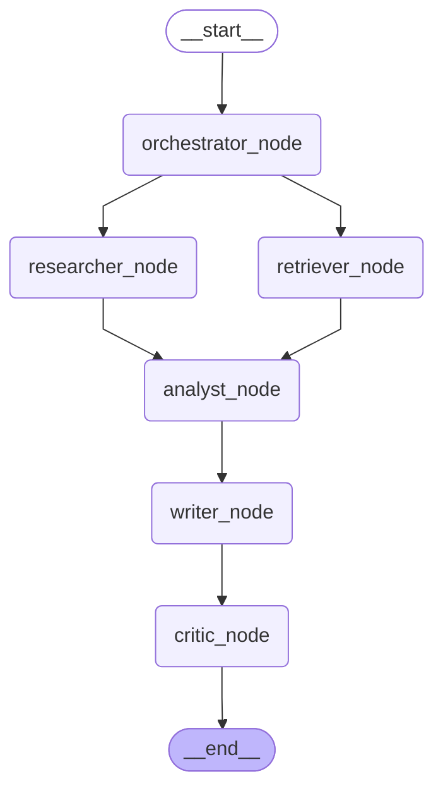

# ResearchMAS

## A modular multi-agent research system with iterative self-reflection

### Key features
- Multi Agent (Orchestrator, Critic etc..)
- Parallel node processing
- State management
- Conditional Routing
- Reflection 
- Reducer-based state
- Multi-source grounding 
- Persistent checkpointer memory
- Persistent Vector Store
- Two-stage RAG integration
- Tools (Reranker, VectorSearch, Web Search)
- Error Handling
- Modular Design
- Centralized Configuration
- Structured Logging
- CLI runtime


### Tech Stack
- LangGraph
- LlamaIndex
- Loguru
- Groq
- Tavily
- HuggingFace

### Graph Structure



### Project Structure
```
ResearchMAS/
├── agents/
│   ├── orchestrator.py
│   ├── researcher.py
│   ├── retriever.py
│   ├── analyst.py
│   ├── writer.py
│   └── critic.py
├── config/
│   ├── config.py
│   └── settings.yaml
├── graph/
│   ├── graph.py
│   └── state.py
├── tools/
│   ├── vector_search.py
│   ├── reranker.py
│   └── web_search.py
├── memory/
├── ingestion.py
├── run.py
├── .env
└── .gitignore
```